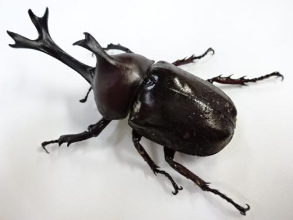

<iframe src="https://openprocessing.org/sketch/1370242/embed/" width="400" height="400"></iframe>

''''# About

組み込み系のハードウェアエンジニアです。  
プライベートでは、自分用のサービス開発の他、料理、空手など幅広く活動しています！
''''
## Profile
- かものはし（ハンドルネーム）
- 富士山の近く
- FPGA、PCB（プリント基板開発）、データベース、サーバサイドプログラミング、EA開発（自動トレード）

## Skills
- C
- Python
- JavaScript (Node.js, Express)
- 英語（TOEIC L&R 855、speaking 130）、翻訳（英日 多少）
